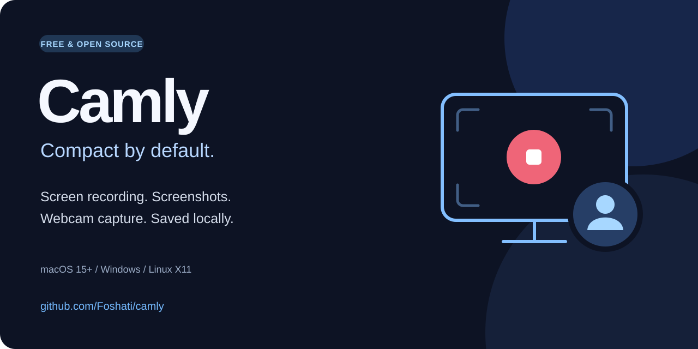

# Camly — ضبط صفحه، اسکرین‌شات و ضبط وب‌کم متن‌باز

**Camly یک ابزار رایگان و متن‌باز برای ضبط صفحه‌نمایش، گرفتن اسکرین‌شات و ضبط وب‌کم روی مک، ویندوز و لینوکس با نشست X11 است.** می‌توانید کل نمایشگر، یک پنجره یا محدودهٔ دلخواه را ضبط کنید و فایل‌ها را روی کامپیوتر خود نگه دارید. برای ساخت آموزش، معرفی محصول و گزارش باگ مناسب است.

**[دانلود آخرین نسخه](https://github.com/Foshati/camly/releases/latest)** · [راهنمای انگلیسی](README.md) · [گزارش مشکل](https://github.com/Foshati/camly/issues/new?template=bug_report.yml) · [پیشنهاد قابلیت](https://github.com/Foshati/camly/issues/new?template=feature_request.yml)

## قابلیت‌ها

- ضبط نمایشگر، پنجره یا ناحیهٔ انتخابی از نوار ابزار شناور.
- گرفتن اسکرین‌شات با امکان ذخیره، پیش‌نمایش و کپی در کلیپ‌بورد.
- عکس‌برداری و ضبط ویدئو با وب‌کم، انتخاب دوربین و میکروفون.
- حباب شناور دوربین با اندازه، شکل و موقعیت قابل تنظیم.
- حالت Compact با حداکثر وضوح 1080p، حالت Balanced با حداکثر 1440p، وضوح اصلی Retina و تنظیمات سفارشی.
- فشرده‌سازی محلی ویدئو و کتابخانهٔ تصاویر و ضبط‌ها.
- میان‌بر سراسری قابل تغییر و توقف خودکار هنگام کم‌شدن فضای دیسک.

حباب دوربین زمانی در خروجی دیده می‌شود که در محدودهٔ ضبط باشد؛ ضبطِ فقط یک پنجره ممکن است آن را شامل نشود. حجم خروجی به مدت، محتوای تصویر، نرخ فریم و تنظیمات وابسته است.

## دانلود و نصب

در [صفحهٔ انتشار](https://github.com/Foshati/camly/releases/latest)، فایل متناسب با سیستم خود را انتخاب کنید:

| سیستم | فایل مناسب | نکته |
|---|---|---|
| macOS 15 و بالاتر، Apple Silicon | فایل aarch64.dmg | برنامه را به Applications بکشید |
| macOS 15 و بالاتر، Intel | فایل x64.dmg | برنامه را به Applications بکشید |
| ویندوز ۱۰ یا ۱۱، ۶۴ بیت | فایل x64-setup.exe یا x64_en-US.msi | فایل EXE برای نصب معمول مناسب است |
| لینوکس، x86_64 | DEB، RPM یا AppImage | ضبط صفحه به X11 و FFmpeg نیاز دارد |

بسته‌های لینوکس روی Ubuntu 24.04 ساخته می‌شوند؛ سازگاری با توزیع‌های قدیمی‌تر تضمین نشده است. برای AppImage مجوز اجرا بدهید و FFmpeg و ابزارهای صوتی سازگار با PulseAudio را نصب کنید.

## شروع سریع

۱. برنامه را باز کنید و دسترسی ضبط صفحه و در صورت نیاز دوربین و میکروفون را بدهید.

۲. روی مک با `⌘ Shift 2` و روی ویندوز/لینوکس با `Ctrl Shift 2` نوار ابزار را باز کنید.

۳. Screenshot یا Record را انتخاب کنید؛ سپس نمایشگر، پنجره یا محدوده را تعیین کنید.

۴. پوشهٔ ذخیره، میکروفون و کیفیت را در تنظیمات انتخاب کنید. برای شروع، حالت Compact و نرخ ۳۰ فریم مناسب است.

۵. ضبط را متوقف کنید و نتیجه را از کتابخانه ببینید. پیش از ضبط طولانی، یک کلیپ کوتاه برای بررسی صدا و تصویر بگیرید.

## تفاوت‌های سیستم‌عامل‌ها

- **مک:** ضبط با ScreenCaptureKit و رمزگذاری سخت‌افزاری VideoToolbox انجام می‌شود. ضبط صدای سیستم و میکروفون و توقف/ادامهٔ ضبط صفحه پشتیبانی می‌شود.
- **ویندوز:** ضبط با FFmpeg و رمزگذاری نرم‌افزاری H.264/HEVC انجام می‌شود. میکروفون پشتیبانی می‌شود؛ ضبط خودکار صدای سیستم و توقف/ادامهٔ ضبط صفحه هنوز پیاده‌سازی نشده‌اند. FFmpeg در نصب‌کننده‌ها موجود است.
- **لینوکس:** ضبط صفحه با FFmpeg در X11 انجام می‌شود. FFmpeg باید روی سیستم نصب باشد. صدای سیستم از مانیتور خروجی صوتی و ابزار pactl گرفته می‌شود.
- **Wayland:** ضبط صفحه هنوز پشتیبانی نمی‌شود؛ برای آن وارد نشست X11 شوید. اسکرین‌شات مسیر جداگانه دارد و به مجوزهای محیط بستگی دارد.

## پرسش‌های رایج

### آیا فایل‌ها آپلود می‌شوند؟

ضبط، فشرده‌سازی و کتابخانهٔ رسانه محلی‌اند. کد فعلی برنامه ورود به حساب، سرویس آپلود ابری یا اتصال تحلیل رفتار کاربران ندارد. فایل‌ها در پوشهٔ انتخابی شما ذخیره می‌شوند.

### برای خروجی کم‌حجم چه تنظیمی انتخاب کنم؟

حالت Compact و نرخ ۳۰ فریم را امتحان کنید. برای پخش در نرم‌افزارهایی که HEVC را باز نمی‌کنند، کدک H.264 و ظرف MP4 را انتخاب کنید. تغییر حالت کیفیت، نرخ فریم را خودکار تغییر نمی‌دهد.

### برنامه رایگان است؟

بله. پروژه با [مجوز MIT](LICENSE) منتشر شده و استفاده و تغییر آن مطابق این مجوز آزاد است.

### برای توسعه یا پیشنهاد قابلیت از کجا شروع کنم؟

برای ساخت برنامه، [راهنمای توسعه](docs/DEVELOPMENT.md) و [راهنمای مشارکت](CONTRIBUTING.md) را بخوانید. برای درخواست قابلیت از [فرم پیشنهاد](https://github.com/Foshati/camly/issues/new?template=feature_request.yml) استفاده کنید و مشکل و کاربرد موردنظرتان را توضیح دهید.

اگر Camly برای شما مفید است، [به مخزن ستاره بدهید](https://github.com/Foshati/camly) و تجربهٔ واقعی استفاده را با دیگران به اشتراک بگذارید.
